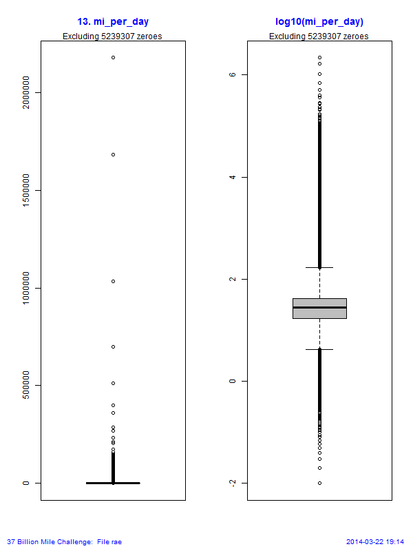

Exploratory Analysis
====================

**Massachusetts 37 Billion Mile Data Challenge**  
**Team Russian Blue #37bill**  

Before running other exploratory analysis, the two .csv files were processed by the [CharCount utility](https://github.com/EarlGlynn/CharCount).  The [results in this PDF](CharCount.pdf) show the files contain no unusual characters.

Subfolders contain exploratory information about these files:  

1. Subfolder **grid_quarters** for **grid_quarters_public_noheader.csv**  
2. Subfolder **rae** for **rae_public_noheader.csv**  

Each of these subfolders contain three types of information: 

Field Summary
-------------

1. A **Field-Summary** table is shown in pdf, Excel and csv formats.  

Each file was first read with all data treated as character strings.  The _cmin_ and _cmax_ columns show the minimum and maximum size of the characters strings.  In particular, the _cmax_ value may be useful for database schema definitions.

The _N_, _Missing_, and _NUnique_ columns tell how many times the field was defined in the file (N), how many times the field was missing (_Missing_), and the number of unique values for the field (_NUnique_).  

Small _NUnique_ values are indicative of ordinal data, which while numeric should not be used in any descriptive statistics. 

Several of the fields in the **grid_quarters* file had more than one character representation of 0 when converted to numeric.  The **ZeroVariation** column shows the zero character strings and their frequency of occurrence.

For numeric data, the **Zero** and **NonZero** columns gives the total number of zeroes (from all the ZeroVariations) and the number of non-zero values.

Finally, for numeric data, the **Min** and **Max** numeric values are shown.

Frequency Counts
----------------

2. The subfolder prefixed with **Counts** has a file with the frequency counts for each of the fields in the file -- except files for fields with a very large number of unique values are not shown if they are 1 MB or larger (in general).  

Often, unusual or unexpected values can be observed at the beginning and end of these counts files.  

Note:  all numeric values are treated as character strings in these frequency counts.

The file number prefixes match the row numbers in the **Field_Summary** table.

For example, the file **15-veh_zip.csv** in the **Counts-rae** subfolders shows frequency counts for all zip codes in the file.  When opened with an ASCII editor, one can learn that about 2.2 million have a veh_zip of "00000", with a number of unusual zip counts, like 78,324 instances of zip 30348 (Atlanta, GA).

Boxplots
--------

3. The subfolder prefixed with **Boxplots** shows boxplots for most numeric values that are not ordinal data. The boxplots are shown with the original data and the log10 values. 

For now, all zero values are ignored in the creation of these boxplots.

Viewing these boxplots is each via these links to the PDF files:    

* [GridQuarters](exploratory/grid_quarters/Boxplots-GridQuarters/GridQuarters-Boxplots.pdf)
* [rae-Boxplots](exploratory/rae/Boxplots-rae/rae-Boxplots.pdf)

From the **rae** file, the following boxplot examples show the **mi_per_day** data are very skewed (even after ignoring zeroes), but are somewhat lognormal, but with a number of outliers:

